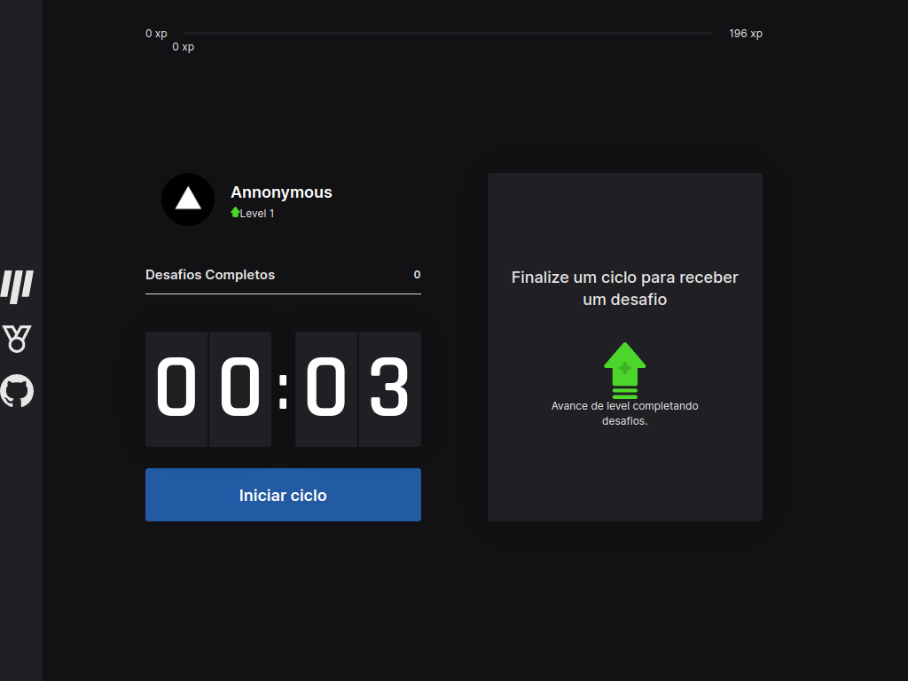
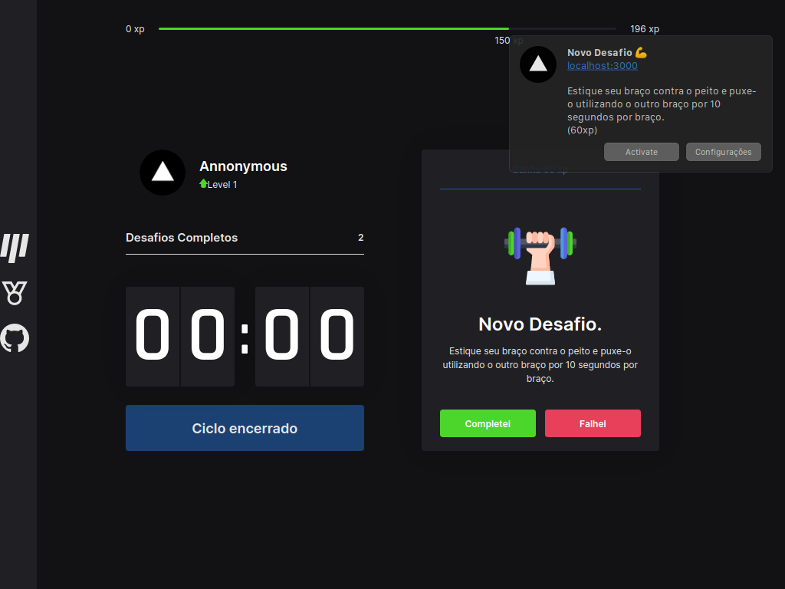
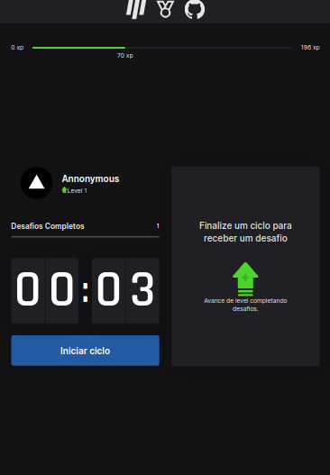
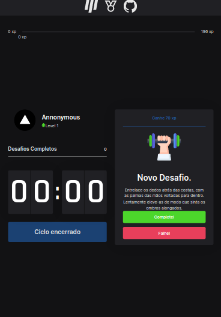
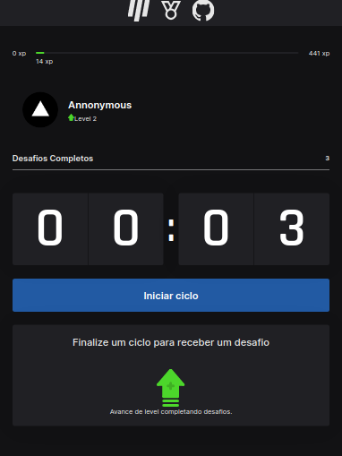
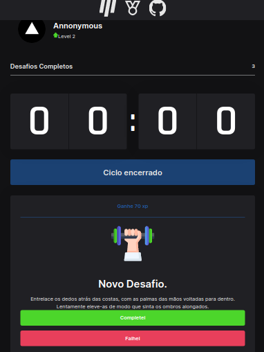
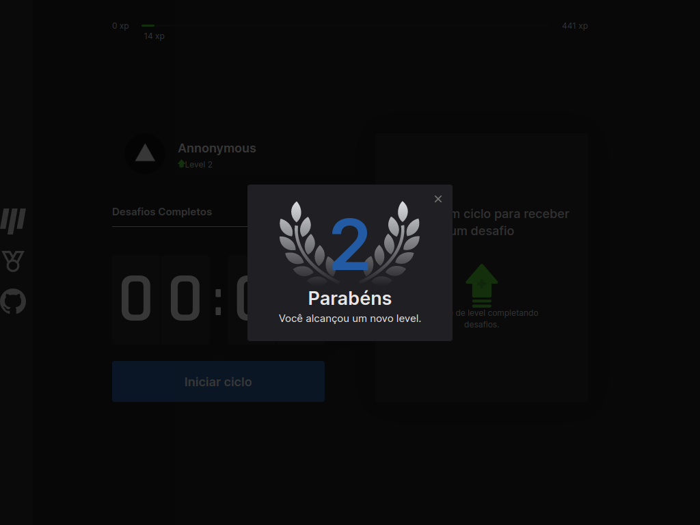

# moveit-pomodoro-app

## Tecnologias
<div>
  
  
  
  
</div>

<!--


-->

## Cloud

<a href="https://vercel.com/dashboard" target="_blank">
  
</a>

## Getting Started
Faça o download projeto [clicando aqui](https://github.com/alexsandersilv/moveit-pomodoro-app/archive/refs/heads/main.zip) ou por linha de comando.
```sh
# git
git clone https://github.com/alexsandersilv/moveit-pomodoro-app

# GitHub CLI
gh repo clone alexsandersilv/moveit-pomodoro-app
```

Depois de terminar o Download do pomodoro entre no diretorio do projeto (``cd moveit-pomodoro-app`` ou ``cd moveit-pomodoro-app-main``), agora podemos instalar as dependências e iniciar o servidor.

```sh
# yarn
yarn 

# npm
npm install
```

Depois de instalar as dependências, o servidor pode ser iniciado. 

**DEV**

```sh
# yarn
yarn run dev

# npm
npm run dev
```

**Build**

```sh
# yarn
yarn run build

# npm 
npm run dev
```

**Start**

```sh
# yarn
yarn run start

# npm 
npm run start
```

## Imagens

### Normal 





### iPad Air
<div style="display:flex" >



  
  <!--


  -->
</div>

### IPad Mini
<div style="display:flex" >
 



  <!--


-->  

</div>


### Level Up ( Modal )



### CSS

A maioria das cores usadas são da plataforma da [@Rocketseat](https://github.com/Rocketseat).

**Variáveis**

```js
colors: {
  text: {
    normal: "#e6e6e6"
  },
  black: {
    bg : "#121214",
    nav: "#202024",
    countdown: "#52525c"
  },
  button: {
    succeeded: "#4cd62b",
    failed: "#e83f5b"
  },
  blue: {
    normal: "#225aa3",
    dark: "#1b4172"
  }
}
```

## LICENSE
```
MIT License

Copyright (c) 2022 Alex Sander

Permission is hereby granted, free of charge, to any person obtaining a copy
of this software and associated documentation files (the "Software"), to deal
in the Software without restriction, including without limitation the rights
to use, copy, modify, merge, publish, distribute, sublicense, and/or sell
copies of the Software, and to permit persons to whom the Software is
furnished to do so, subject to the following conditions:

The above copyright notice and this permission notice shall be included in all
copies or substantial portions of the Software.

THE SOFTWARE IS PROVIDED "AS IS", WITHOUT WARRANTY OF ANY KIND, EXPRESS OR
IMPLIED, INCLUDING BUT NOT LIMITED TO THE WARRANTIES OF MERCHANTABILITY,
FITNESS FOR A PARTICULAR PURPOSE AND NONINFRINGEMENT. IN NO EVENT SHALL THE
AUTHORS OR COPYRIGHT HOLDERS BE LIABLE FOR ANY CLAIM, DAMAGES OR OTHER
LIABILITY, WHETHER IN AN ACTION OF CONTRACT, TORT OR OTHERWISE, ARISING FROM,
OUT OF OR IN CONNECTION WITH THE SOFTWARE OR THE USE OR OTHER DEALINGS IN THE
SOFTWARE.
```
